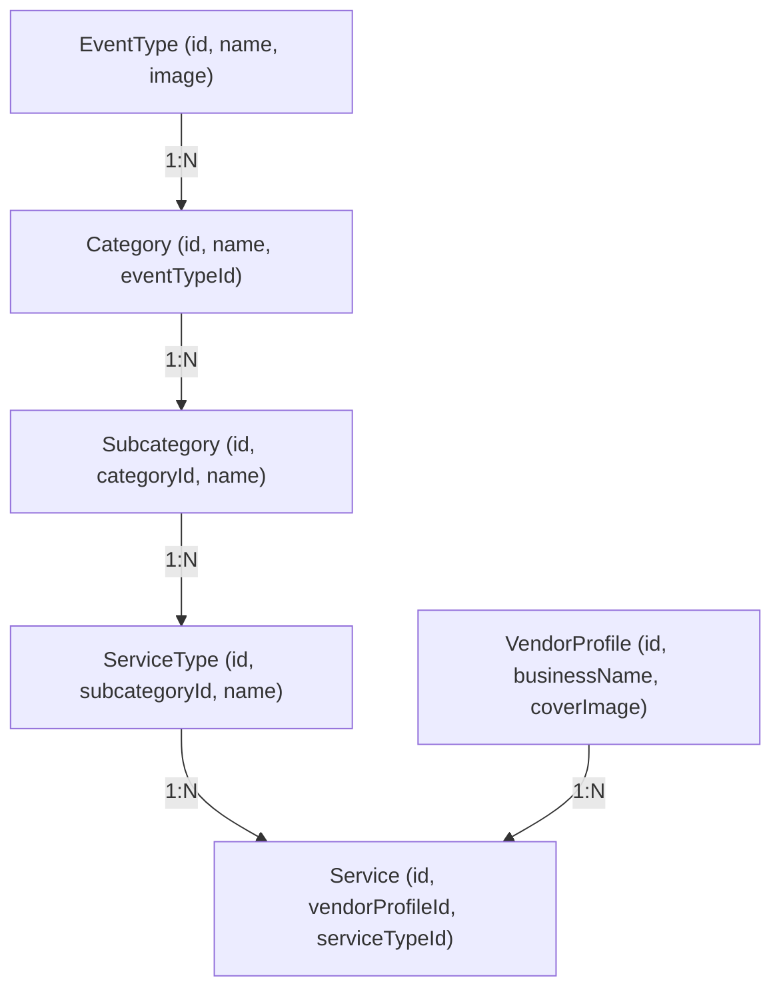

# Architecture Audit: Event Categories System

This document details the research and documentation of the existing architecture for the Event Categories system, ensuring a database-driven and scalable implementation.

## 1. Current Rendering Status

- **`CategoryIcons` Component**: Currently exists in `src/components/home/sections/CategoryIcons.tsx`.
- **Usage**: **NOT RENDERED**. A project-wide search confirms this component is not imported or used in any active page (including `src/app/(public)/page.tsx` and `src/app/(public)/HomeClient.tsx`).
- **Reason**: The homepage currently prioritizes "Amazon-style" feature grids (Featured Planners, Trending Services) and uses a static navigation model in the `SubNavbar` for category entry.

## 2. Responsible Components

- **Homepage**: No component is currently responsible for a dedicated "Event Categories" section.
- **Marketplace**: `CategoryBar.tsx` handles filtering by Category, but it is driven by static configuration (`src/config/navigation/categories.ts`).
- **Navigation**: `SubNavbar.tsx` and `MainNavbar.tsx` use static lists.

## 3. Database Schema & Relationships

### Data Models
- **`eventtype`**: Root level (e.g., Wedding, Corporate).
  - **Fields**: `id`, `name`, `description`, `image`, `icon`, `isActive`.
- **`category`**: Second level (e.g., Photography, Decoration).
  - **Fields**: `id`, `name`, `eventTypeId`, `image`, `icon`.
- **`subcategory`**: Third level.
- **`servicetype`**: Fourth level.
- **`service`**: The actual offering by a vendor.
- **`vendorprofile`**: The professional providing the services.

### Relationship Chain


## 4. Image Architecture

- **Event Type Card**: MUST use `eventtype.image`.
- **Fallback Logic**: If `eventtype.image` is null, the system should use the global fallback defined in `src/config/cloudinary.ts` via the `optimizeImage` utility.
- **No Hardcoding**: Images will be served via Cloudinary transformations based on the DB URL.

## 5. Vendor Filtering Logic

The marketplace already supports `eventTypeId` as a query parameter.
- **Path**: `/marketplace?eventTypeId={id}`
- **Server logic (`src/lib/marketplace.ts`)**:
  ```sql
  AND EXISTS (
      SELECT 1 FROM service s
      JOIN servicetype st ON s."serviceTypeId" = st.id
      JOIN subcategory sc ON st."subcategoryId" = sc.id
      JOIN category c ON sc."categoryId" = c.id
      WHERE s."vendorProfileId" = v.id AND c."eventTypeId" = ${filters.eventTypeId}
  )
  ```
- **Conclusion**: The routing and backend logic are already in place to support the dynamic card clicks. No modifications to the API or Marketplace logic are required.

## 6. Audit Conclusion

The redesign of the "Event Categories" section is architecturally safe. It requires integrating the existing `CategoryIcons` component into `page.tsx` and rewriting its UI to match the premium 16:9 card specification, while strictly using the `initialEventTypes` data already being fetched on the server.
