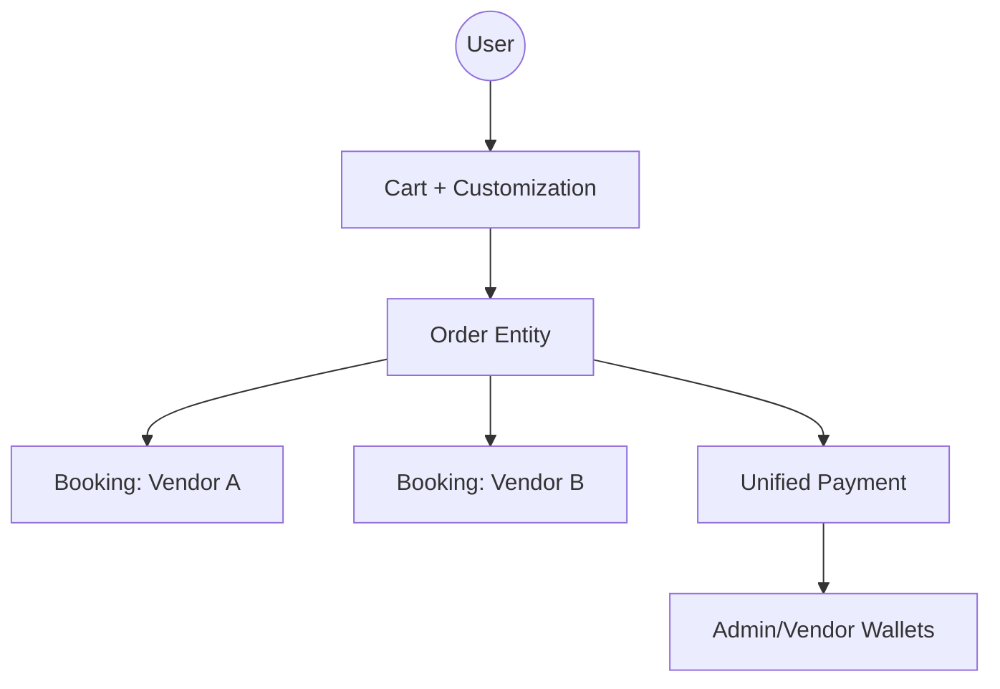
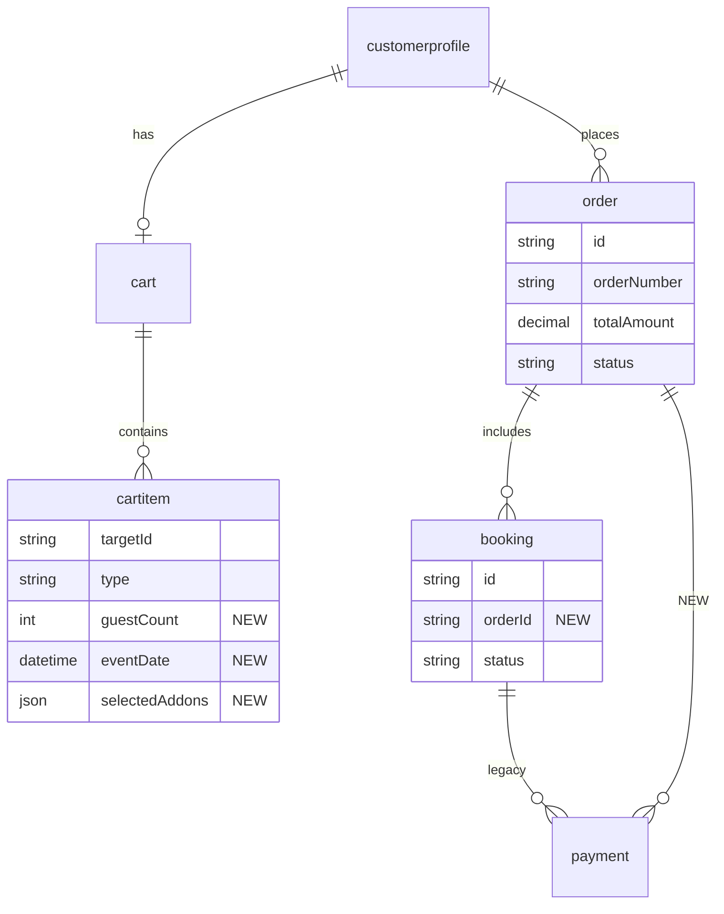
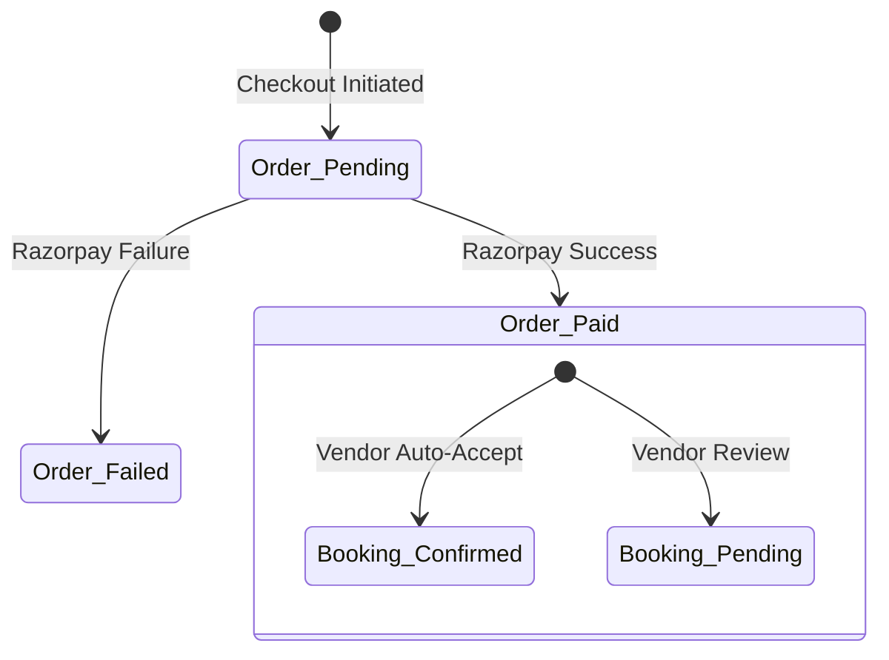
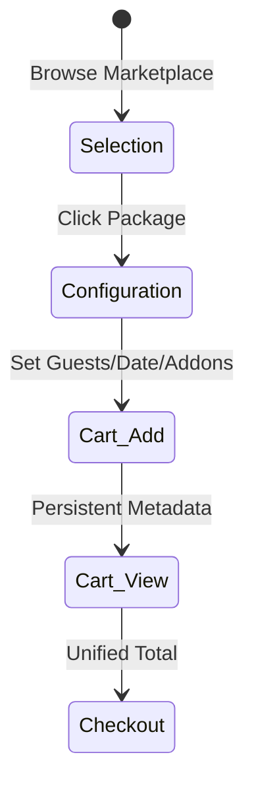
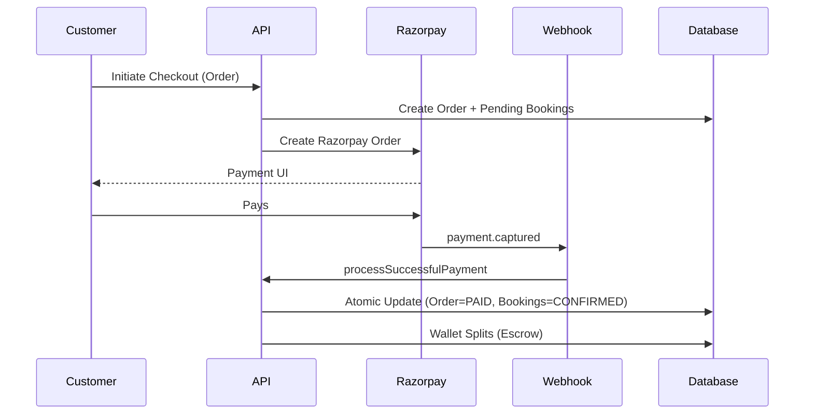
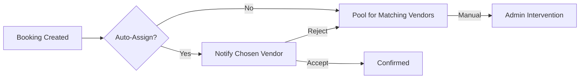
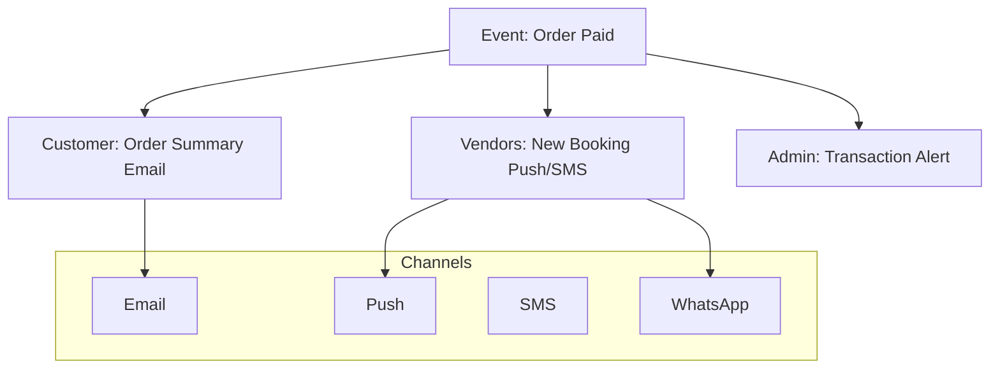

# Mana Events Domain & Impact Analysis

This document provides a comprehensive analysis of the proposed architectural shift from a single-vendor booking system to a multi-vendor enterprise order system.

---

## 1. Domain Analysis & Strategy

### 1.1 Order Domain: Evolutionary Path
We evaluated two approaches for the Order entity:

| Feature | Approach A: Evolution (Booking = Order) | Approach B: Parent (New Order Entity) |
| :--- | :--- | :--- |
| **Concept** | Refactor `Booking` to support multiple vendors. | Introduce `Order` as a parent of `Booking`. |
| **Migration** | High Complexity (Breaking schema changes). | **Low Complexity** (Add-only schema changes). |
| **Backward Compatibility** | Risky. Existing mobile/web apps will break. | **High**. Existing booking logic remains intact. |
| **Performance** | Potential index bloat in single table. | Clean separation of concerns. |
| **Risk Level** | High (Critical business logic rewrite). | **Low** (Extending existing logic). |

**Recommendation**: **Approach B (Parent Order Entity)**.
- An `Order` represents the customer's intent and the financial transaction.
- A `Booking` represents the specific operational agreement with a single vendor.
- This allows a customer to "Order" 5 services, resulting in 1 Payment and 5 independent Bookings.

---

### 1.2 Booking Domain: Lifecycle Integrity
The `Booking` model is the core of the vendor's dashboard. Modifying its fundamental lifecycle would disrupt vendor operations.

**Proposed Change**:
- Link `Booking` to `Order` via optional `orderId`.
- Bookings created via the new cart flow will have an `orderId`.
- Legacy bookings or direct-to-vendor bookings (if supported) will remain `orderId: null`.

---

### 1.3 Cart Domain: Intent Persistence
The current cart is too "thin." It loses user configuration when navigating.

**Evolution Strategy**:
- Extend `cartitem` with customization fields (`eventDate`, `guestCount`, `addons`).
- This ensures that when a user moves from "Catering" to "Photography," their `eventDate` and `guestCount` are persisted and pre-filled.

---

### 1.4 Payment Domain: Unified Checkout
Currently, `payment` points to `bookingId`.

**Strategy**:
- Introduce `orderId` to the `payment` and `payment_split` models.
- Razorpay Order will be created for the `Order.id`.
- On success, the `Order` status is updated, and all child `Bookings` are transitioned to `CONFIRMED` or `ADVANCE_PAID` atomically.

---

## 2. Deliverables & Diagrams

### 2.1 Domain Architecture


### 2.2 ER Diagram (Current vs Proposed)


### 2.3 Order & Booking Lifecycles


### 2.4 Database Dependency Matrix

| Model | Status | Purpose | Risk |
| :--- | :--- | :--- | :--- |
| `order` | **NEW** | Primary transaction entity. | Low (New table) |
| `cartitem` | **MOD** | Stores intent (guests, date). | Medium (Data migration) |
| `booking` | **MOD** | Link to parent order. | Low (Nullable field) |
| `payment` | **MOD** | Link to parent order. | Low (Nullable field) |
| `wallet` | No Change | Tracks balances. | None |
| `vendorprofile` | No Change | Tracks vendor data. | None |

---

## 3. Operational Flows

### 3.1 Cart Lifecycle


### 3.2 Payment Lifecycle


### 3.3 Vendor Assignment Flow


### 3.4 Notification Flow


---

## 4. Migration & Rollback Strategy

### 3.1 Zero-Downtime Migration Plan
1. **Schema Update**: Apply Prisma migrations with nullable fields.
2. **Double Write (Optional)**: Start populating `order` records even for single bookings to test reporting.
3. **API Deployment**: Deploy updated Cart and Checkout APIs.
4. **UI Rollout**: Enable "Add to Cart" with customization UI.
5. **Data Cleanup**: After 30 days, enforce `orderId` if appropriate.

### 3.2 Rollback Plan
- **Database**: Do not remove any columns. `booking` remains fully functional without `orderId`.
- **Application**: The `pricingService` and `paymentService` will have fallbacks:
  ```typescript
  const targetId = payment.orderId || payment.bookingId;
  ```
- **Action**: If Order creation fails, the system can revert to the legacy single-booking flow via a feature flag.

---

## 4. Risk Assessment

| Risk | Impact | Mitigation |
| :--- | :--- | :--- |
| **Payment Split Error** | High | Atomic transactions for wallet credits; detailed audit logs. |
| **Orphaned Bookings** | Medium | Cleanup cron job for `Order_Pending` older than 24h. |
| **N+1 Performance** | Medium | Use Prisma `include` and bulk fetching in the new Order-based Admin views. |
| **Broken UI** | Medium | Feature flags to toggle the new "Amazon-style" flow for specific users/cities first. |
