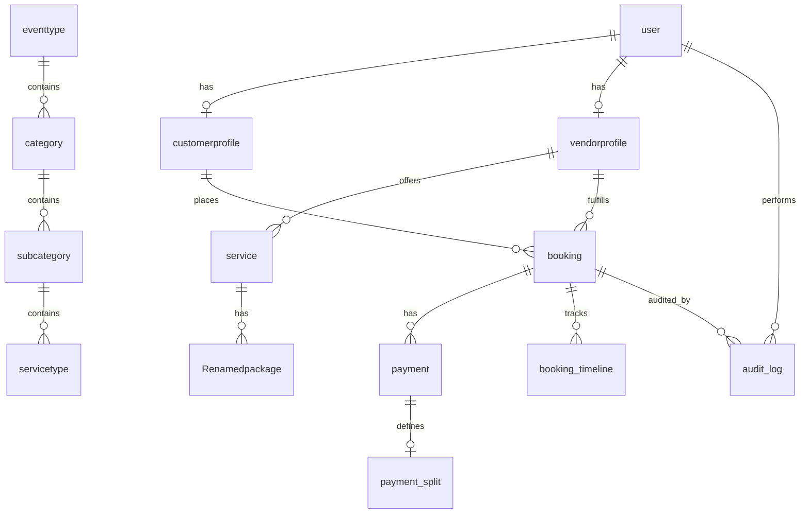

# Mana Events: Technical Reference (API & Database)

This consolidated document provides a code-first mapping of the Mana Events backend, including the database schema, core business logic, and API surface.

---

## 1. Database Reference

### Entity Relationship Overview



### Core Models & Constraints

#### 1.1 Identity & Profiles
| Model | Key Fields | Constraints / Notes |
| :--- | :--- | :--- |
| `user` | `id`, `email`, `role` | `email` and `mobileNumber` are unique. Roles: `CUSTOMER`, `VENDOR`, `ADMIN`. |
| `customerprofile` | `userId`, `loyaltyPoints` | Linked 1:1 with `user`. Owns addresses and workspaces. |
| `vendorprofile` | `userId`, `verificationStatus` | Linked 1:1 with `user`. Tracks reliability and search scores. |

#### 1.2 Service Catalog (Canary Verified)
> [!IMPORTANT]
> **Canary Check:** The relationship between Event Types and Categories has been modernized to a Direct FK structure with composite uniqueness.
> ```prisma
> model category {
>   eventTypeId String
>   name        String
>   eventtype   eventtype @relation(fields: [eventTypeId], references: [id])
>   @@unique([name, eventTypeId])
> }
> ```

#### 1.3 Booking Engine
- **Snapshotting:** `snapshot` (Json) captures the state of services at the time of booking.
- **Identifiers:** `bookingNumber` (Unique) is the user-facing ID. `idempotencyKey` prevents duplicate processing.

---

## 2. API Reference & Business Logic

### 2.1 Identity & Authentication
- **[POST] `/auth/login`**: Authenticates users. Triggers 2FA (Resend API) for `CUSTOMER` and `VENDOR`.
- **[POST] `/auth/verify-otp`**: Validates 6-digit OTP with a 5-second buffer for clock drift.
- **Session Revocation (Hardened):** The `authStore.logout()` method is an asynchronous flow that ensures both client-state purging and server-side session invalidation via the `/api/auth/logout` endpoint.

```typescript
// src/store/authStore.ts (Hardened Logout)
logout: async () => {
  if (typeof window !== 'undefined') {
    try {
      const response = await fetch("/api/auth/logout", { method: "POST" });
      if (!response.ok) console.error("Server-side logout failed", response.status);
    } finally {
      set({ user: null, accessToken: null, isInitialized: true });
      localStorage.clear();
      sessionStorage.clear();
      window.location.href = "/login";
    }
  }
}
```

### 2.2 Booking Engine (Pricing Logic)
> [!IMPORTANT]
> **Pricing Integrity Verification (Source of Truth)**
> The system enforces strict server-side authority. The client payload is never trusted for final totals. The `/api/bookings` route re-derives all pricing from the `packageId` and `guestCount` validated against the database.
>
> ```typescript
> // src/app/api/bookings/route.ts (Lines 82-87)
> const pricing = await pricingService.calculateBookingPrice({
>     packageId: validated.packageId,
>     guestCount: validated.guestCount,
>     addonIds: validated.selectedAddonIds
> }, undefined, pkg);
> ```

> [!NOTE]
> **Business Risk Awareness (Headcount Reporting):** While price manipulation (e.g., overriding the base package rate) is technically prevented by server-side derivation, the `guestCount` remains a customer-reported value. The server trusts the `validated.guestCount` from the request for calculation. Under-reporting headcount to reduce the total amount is a business risk managed via downstream vendor confirmation during service delivery, not a technical exploit.

### 2.3 Financial Layer & Razorpay
- **Verification:** Uses HMAC `sha256` signature verification (`orderId + "|" + paymentId`).
- **Payment Release:** Restricted to the `CUSTOMER`. Triggers wallet credit for the vendor only if status is `EVENT_COMPLETED`.

---

## 3. Background Job Architecture (Inngest)

Mana Events utilizes **Inngest** for reliable, event-driven background processing, handling tasks that require retries, delays, or complex orchestration.

### 3.1 Core Workflows & Reliability

Each worker is designed with step-based execution to handle failures gracefully and includes specific safeguards for financial and operational integrity.

#### 1. Order Fulfillment & Idempotency
The `handleOrderConfirmation` worker transforms paid orders into individual `booking` entities. It uses a combination of `step.run` with deterministic IDs and a database lookup to ensure fulfillment is idempotent.

```typescript
// src/inngest/booking-functions.ts
for (const item of order.order_item) {
  await step.run(`fulfill-item-${item.id}`, async () => {
    // Idempotency Check: Don't create if booking already exists for this item
    const existing = await prisma.booking.findFirst({
        where: { orderId: order.id, packageId: item.packageId, vendorId: item.vendorId }
    });
    if (existing) return;
    // ... booking creation logic ...
  });
}
```

#### 2. Escrow Release & Dispute Protection
The system ensures vendor payouts are held in escrow for a 24-hour "cooling-off" period post-event and hard-blocks the release if a dispute is open.

```typescript
// src/inngest/payment-functions.ts
await step.sleepUntil("wait-for-event-completion", releaseTime); // eventDate + 24h

await step.run("release-funds", async () => {
  const booking = await prisma.booking.findUnique({
    where: { id: bookingId },
    include: { vendorprofile: true }
  });

  if (booking?.status === "CONFIRMED") {
     const activeDispute = await prisma.dispute.findUnique({
       where: { bookingId }
     });

     if (activeDispute && activeDispute.status !== "RESOLVED") {
       logger.warn(`[Escrow] Skipping fund release for booking ${bookingId} due to active dispute`);
       return { status: "DISPUTED" };
     }
     // ... atomic wallet update transaction ...
  }
});
```

#### 3. Delayed Notifications & Reminders
Uses `step.sleep` to implement conditional reminder logic (e.g., 2-hour wait for vendor acceptance before escalating via SMS).

---

## 4. Frontend Architecture

The Mana Events frontend is a Next.js (App Router) application utilizing a hybrid state management strategy and an atomic UI structure.

### 3.1 State Management Strategy
The application splits state into three distinct layers:
1.  **Server State (React Query):** Manages all asynchronous data fetching, caching, and synchronization with the Prisma/Next.js API.
2.  **Global Client State (Zustand):**
    *   `authStore`: Persists session tokens and user profiles using `zustand/middleware/persist`.
    *   `checkoutStore`: A complex, non-persisted state machine managing the 8-step booking process.
    *   `commerceStore`: Manages the cart, wishlist, and real-time syncing via the `useCommerceSync` hook.
3.  **Real-time State:** Managed via `socketStore`, which is reactively connected/disconnected in the root `Providers.tsx` based on the current `accessToken`.

### 3.2 Core State Logic (Verbatim)

#### Session Management & Logout
The `authStore` ensures a clean slate on logout to prevent state leakage between users and invalidates the session server-side.
```typescript
// src/store/authStore.ts
logout: async () => {
  if (typeof window !== 'undefined') {
    try {
      const response = await fetch("/api/auth/logout", { method: "POST" });
      if (!response.ok) console.error("Server-side logout failed", response.status);
    } finally {
      set({ user: null, accessToken: null, isInitialized: true });
      localStorage.clear();
      sessionStorage.clear();
      window.location.href = "/login";
    }
  }
}
```

#### Multi-Step Checkout Flow
The `checkoutStore` manages the complex transition from selection to payment, including proactive pricing fetches.
```typescript
// src/store/checkoutStore.ts
fetchServerPricing: async () => {
  const { packageId, selectedAddonIds, items } = get();
  const { guestCount } = get().eventDetails;
  set({ isPricingLoading: true });
  try {
    const res = await apiClient.post("/bookings/calculate", {
      items: items.length > 0 ? items : [{ packageId, selectedAddonIds }],
      guestCount: guestCount || 100
    });
    set({ pricing: res.data });
  } finally {
    set({ isPricingLoading: false });
  }
}
```

### 3.3 UI Component Architecture
- **Base Components:** Built on **Shadcn/UI** (Radix UI + Tailwind CSS) located in `src/components/ui/`.
- **Atomic Patterns:** Common layouts (Navbars, Footers) are wrapped in `NavbarWrapper` and `FooterWrapper` to handle conditional rendering across different routes (e.g., Admin vs. Customer).
- **Performance:** Implements `nextjs-toploader` and custom preconnect/prefetch hints in the root layout to optimize LCP for marketplace image assets.

---

## 4. Administrative Operations
- **Vendor Moderation:** Manual approval/rejection via `verificationStatus`.
- **Audit Logging:** All critical actions are recorded in the unified `audit_log` table with point-in-time JSON diffs (`oldValue` vs `newValue`).
