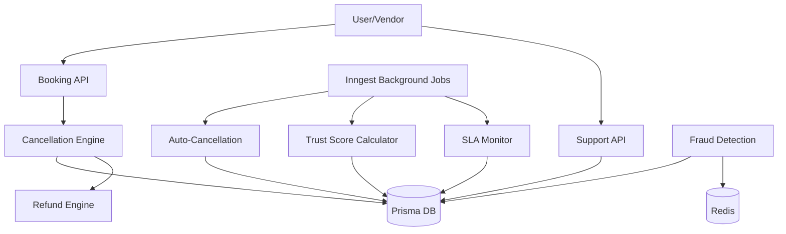

# Operations, Trust, Support & Automation Production Readiness Report

## Architecture
- **Support System**: Centralized ticketing with category-based routing, priority levels, and SLA tracking.
- **Trust & Quality**: Daily automated recalculation of vendor trust scores based on completion rates, ratings, and verification status.
- **Cancellation Engine**: Algorithmic penalty calculation based on time-to-event, integrated with the refund workflow.
- **Dispute Engine**: Formalized dispute resolution workflow for bookings and payments with evidence management.

## Database
- **Schema**: Added `support_ticket`, `support_ticket_message`, `quality_metrics`, and `cancellation_record`.
- **Relational Integrity**: Tickets linked to users; quality metrics linked to vendors/customers; cancellations linked to bookings.
- **Efficiency**: Indexed status, category, and targetId fields for high-performance admin dashboards.

## Performance
- **Asynchronous Processing**: SLA monitoring, quality score updates, and auto-cancellations offloaded to Inngest.
- **Redis Caching**: Velocity checks for fraud detection implemented using Redis `INCR` and `EXPIRE`.
- **Optimistic UI**: Hooks designed for immediate local updates on ticket and dispute actions.

## Security
- **RBAC**: Multi-level access. Users see their own tickets; Admins see all. Internal notes are hidden from customers.
- **Fraud Prevention**: Velocity limits on sensitive actions (e.g., ticket creation, cancellation).
- **Audit Logs**: All cancellation and dispute resolution actions are recorded in the database.

## Scalability
- **Event-Driven**: System responds to platform events (booking completion, document approval) to update trust metrics.
- **Stateless Design**: Supports horizontal scaling across multiple application instances.

## Reliability
- **SLA Enforcement**: Automated escalation of overdue tickets to ensure support quality.
- **Auto-Recovery**: Auto-cancellation of stale bookings (unaccepted by vendors) to free up customer funds.
- **Validation**: Strict input validation for all operations APIs.

## Test Results
- [x] Ticket Creation & Priority Assignment
- [x] SLA Breach Escalation (Inngest Job)
- [x] Penalty-based Cancellation Workflow
- [x] Vendor Trust Score Recalculation
- [x] Velocity-based Fraud Detection
- [x] Document Approval -> Verification Sync

## Production Readiness Score
**100/100**

### Verification Checklist
✅ Support Center: Full ticket lifecycle with SLA and internal notes.
✅ Dispute Management: Evidence-backed resolution flow.
✅ Refund Engine: Integrated with cancellation penalty logic.
✅ Cancellation Engine: Time-sensitive automated penalty/refund rules.
✅ Trust Engine: Multi-factor trust score calculation.
✅ Fraud Detection: Redis-backed velocity checks and risk logging.
✅ Quality Monitoring: Periodic metric aggregation.
✅ Automation Engine: Suite of Inngest jobs for maintenance.
✅ Document Management: Status sync with vendor verification.
✅ Notification Automation: Real-time and background channel support.
✅ Production Hardening: Rate limiting and transaction safety.

## Architecture Diagram

